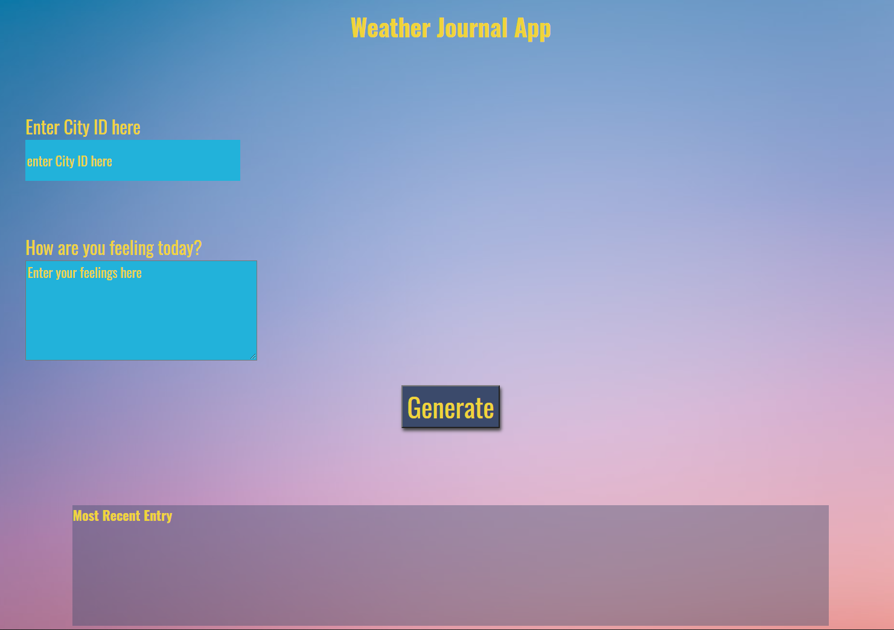

# Weather_App-JS_API-Demo

# Description :
Simple NODE.JS Code include https://openweathermap.org/ APIs using local server 
then Response All Info about Weather and Current Date to Client Browser 

# Tools :
<li> Nodejs
<li> NPM 
<li> openweathermap API  

# Project Strucutre : 
 # index.html 
 # CSS [ style ]
 # js/ [ app , keys ]
 # readme.md

# How Setup 
 <li> download project 
 <li> unzip it 
 <li> open terminal in project directory 
 <li> Write <code> npm i  </code>
 <li> Write <code> node server </code>
 <li> open Browser on 127.0.0.1:8000 [ if you will use port number : 8000 ]
<li> finally test 

# Demo 

